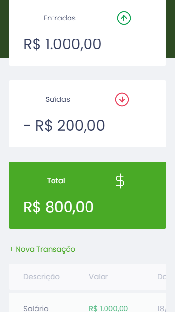
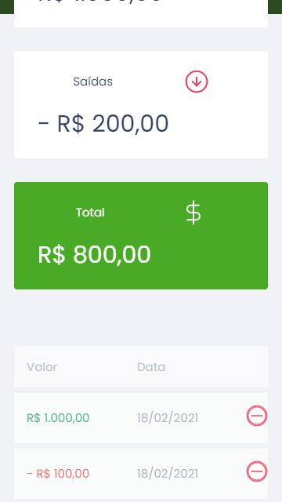

# mrtn-discovery-0121

Este repositório contém o projeto desenvolvido na maratona discovery promovida pela RocketSeat em Janeiro e Fevereiro de 2021.

Para acessar o site do projeto, <a href="https://fbnnd1.github.io/maratona-discovery-0121">Clique aqui</a>.

## Descrição do projeto

Gerenciador de finanças simples direcionados para quaisquer pessoas com acesso à Internet.

## Funcionalidades

* Cadastrar receitas e despesas;
* Exibição do saldo.

## Observações

Os dados sobre referentes as transações são armazenados no armazenamento local (local storage) do navegador.

## Aprimoramentos

Para facilitar a experiência do usuário no cadastro de receitas e despeesas, ao invés do usuário indicar com sinal negativo (-) no campo valor que determinada transação é uma despesa, ele faz essa indicação por meio de um campo específico do formulário.

## Telas

### **Tela Principal**

**Desktop**

**Mobile**

<table>
<tr>
<td></td>
<td></td>
</tr>
</table>

### **Formulário de Cadastro de Transações**

**Desktop**

**Mobile**

