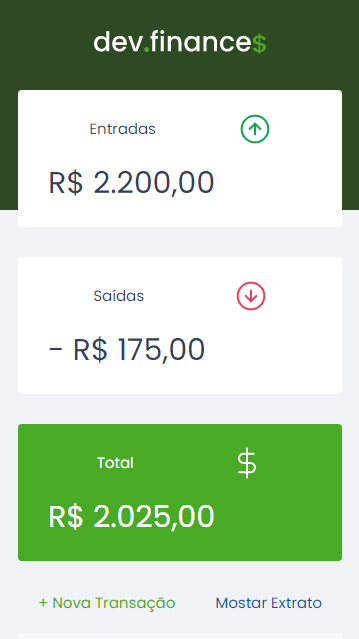
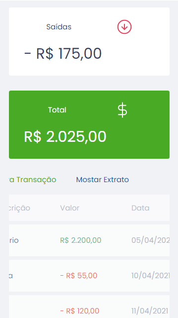

# Dev.Finance$

## Sobre

Este repositório contém o projeto desenvolvido na maratona discovery promovida pela [RocketSeat](https://rocketseat.com.br) em Janeiro e Fevereiro de 2021.

Para acessar o site do projeto, <a href="https://fbnnd1.github.io/dev-finances">clique aqui</a>.

## Descrição do projeto

Gerenciador de finanças simples direcionado para quaisquer pessoas com acesso à Internet. O sistema funciona através de um site na Internet.

### Observações

Os dados referentes às transações são armazenados no armazenamento local (local storage) do navegador.

## Funcionalidades

* Cadastrar receitas e despesas;
* Exibição do saldo;
* Exibição de extrato com as transações.

## Aprimoramentos

1. Para facilitar a experiência do usuário no cadastro de receitas e despesas, ao invés do usuário indicar com sinal negativo (-) no campo valor que determinada transação é uma despesa, ele faz essa indicação por meio de um campo específico do formulário;

2. Extrato ordenado pela data da transação com variação do saldo.

## Tecnologias utilizadas

* HTML;
* CSS;
* Javascript.

## Telas

### **Tela Principal**

**Desktop**

**Mobile**

<table>
<tr>
<td></td>
<td></td>
</tr>
</table>

### **Formulário de Cadastro de Transações**

**Desktop**

**Mobile**

### **Extrato**

## Agradecimentos

Segue o agradecimento a toda a comunidade de devs que participou do evento e membros da Rocketseat, em especial ao professor [Mayk Brito](https://www.youtube.com/user/maykbrito).

## Links Externos

- Twitter do professor Mayk Brito: https://twitter.com/maykbrito  
- Canal do Youtube do professor Mayk Brito: https://www.youtube.com/user/maykbrito  
- Instagram do Tiago Luchtenberg, designer responsável pelo layout da aplicação: https://www.instagram.com/tiagoluchtenberg/
